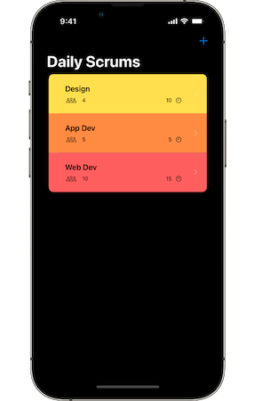

[toc]

# [01. 开始 Scrumdinger](https://developer.apple.com/tutorials/app-dev-training/getting-started-with-scrumdinger)

通过使用 SwiftUI 构建功能齐全的应用程序，了解 iOS 应用程序开发的基本要素

在模块开始之前，请花几分钟时间熟悉背景要求、SwiftUI 背后关键概念以及您将构建的应用程序

## 关于此模块

这些教程是为不熟悉 SwiftUI 的有经验的开发人员创建的。 在开始之前，您需要对 Swift 有所了解，因此请先查看 Swift 编程语言的[基础知识](https://docs.swift.org/swift-book/LanguageGuide/TheBasics.html)，以了解语法、数据类型和独特的语言特性（例如可选项）的概述。 还要查看[闭包](https://docs.swift.org/swift-book/LanguageGuide/Closures.html)部分，因为您会在 SwiftUI 中经常使用它们。

## SwiftUI 综述

SwiftUI 是一个用于为任何 Apple 平台构建应用程序的声明性框架。 SwiftUI 使用单一语言和通用 API 定义应用程序的 UI 和行为。

使用这些关键的 SwiftUI 功能更快地创建应用程序并减少错误：

* Declarative syntax（声明式语法）——使用简单的 Swift 结构定义屏幕上显示的视图。 您的视图会自动保持最新。
* A compositional API（组合API）——使用内置视图和修改器快速创建和迭代您的 UI。 通过组合更简单的视图来组合更复杂的视图。
* A powerful layout system（强大的布局系统）——当现有视图和控件不能满足您的需求时，您可以自己绘制。
* Views that reflect app data （反映应用数据的视图）——定义视图的数据依赖关系，当数据发生变化时，SwiftUI 会自动更新视图，避免无效视图状态导致的错误。
* Automatic accessibility support（自动辅助功能支持）——SwiftUI 增加了基本的辅助功能，您将学会以最少的努力来增强这些功能。

### App 之旅

许多软件工程团队使用日常会议（称为 scrums）来计划他们当天的工作。 Scrums 是简短的会议，每位与会者都讨论他们昨天完成的工作、他们今天的工作以及可能影响他们工作的任何障碍。

本模块将指导您完成 Scrumdinger 的开发，这是一款帮助用户管理日常 Scrums 的 iOS 应用程序。 为了帮助保持 Scrums 简短而集中，Scrumdinger 使用视觉和音频提示来指示每个与会者应该在何时以及多长时间发言。 该应用程序还显示一个进度屏幕，显示会议剩余时间并创建用户可以稍后参考的脚本。

以下是您将在此模块中构建的内容的详细介绍。

### Scrum 列表

应用程序的主屏幕显示每个用户每日 scrums 的摘要。 用户可以点击列表中的一行来查看 scrum 的详细信息，或者通过点击导航栏中的添加 (+) 按钮来创建新的 scrum。

### Scrum 详情和编辑

详细信息屏幕显示有关 scrum 的更多信息，包括每个与会者的姓名和以前的会议列表。 用户可以通过点击编辑按钮来修改任何 scrum 的属性。 编辑屏幕包括一个选择器，用户可以使用该选择器更改每个会议的颜色主题。 点击列表顶部的开始会议按钮会启动一个新的会议计时器。

### Meeting Timer

会议计时器顶部的进度条显示会议已用时间和剩余时间。 该应用程序会在屏幕中央显示当前发言人的姓名，并在屏幕底部显示一个前进至下一位发言人的按钮。

圆形进度环中的段代表每个与会者。 当与会者使用他们所有的时间时，Scrumdinger 会播放“叮”声并在环中添加一个新片段。 响铃满时会议结束。

### Tips for Success

* 边做边学最好。 每个教程都包括入门项目和已完成的项目。 打开启动项目并完成教程中的每个步骤。
* 在你的学习中发挥积极作用。 在查看代码差异之前，请阅读每个步骤并考虑如何完成给定任务。
* 确保安装最新版本的 Xcode。

### Time to Begin

现在您已经看到了 Scrumdinger，是时候构建它了。 如果您卡住了，请不要担心。 您可以在学习教程时查看每个步骤的代码差异，也可以在 Xcode 中下载并查看已完成的项目。 您还可以访问 [Apple 开发者论坛](https://developer.apple.com/forums/tags/swiftui)以获取有关各种开发主题的帮助。

