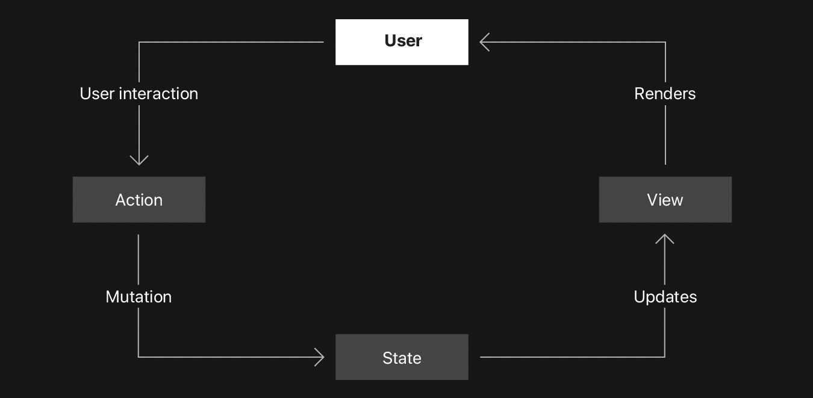
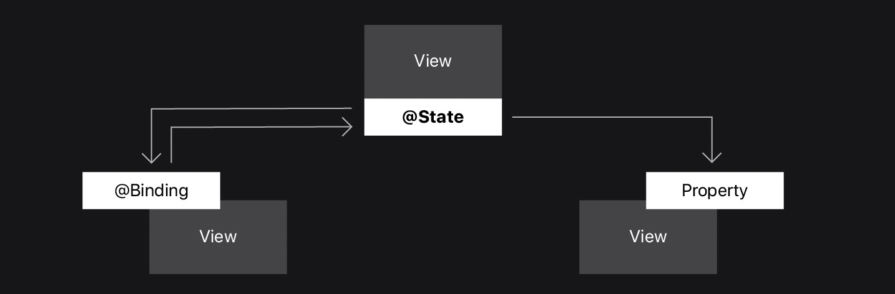

[toc]

# [管理视图之间的数据流](https://developer.apple.com/tutorials/app-dev-training/managing-data-flow-between-views)

向用户显示信息并根据用户交互修改数据是大多数应用程序的基本功能。 

在本文中，您将学习如何使用 @State 和 @Binding 来确保您的用户界面反映应用数据的当前状态。

## 真实数据源

维护多个信息副本可能会导致不一致，从而导致您的应用程序出现错误。 为避免数据不一致错误，请为应用程序中的每个数据元素使用单一事实来源。 将元素存储在一个位置 - 事实来源 - 并且任意数量的视图都可以访问同一条数据。

您可以在整个代码中创建事实来源。 定义每个事实来源的方式和位置取决于数据是否在多个视图之间共享以及数据是否更改。

在 Scrumdinger 中，您将在 ScrumdingerApp 中建立一个事实来源，其他视图将共享访问该来源。

## Swift 属性包装器

在 Swift 中，属性包装器封装了一种常见的属性初始化模式，帮助您有效地向属性添加行为。 

SwiftUI 使用 @State 和 @Binding 属性包装器等来帮助您维护数据的单一真实来源。

## State

当您将属性声明为 @State 时，您在视图中创建了一个事实来源。 系统识别依赖于@State 属性值的视图的所有元素。

用户交互可能会更改您的 @State 属性。 系统通过更新依赖于该属性的任何视图来呈现新版本的 UI。

当@State 属性值更改时，系统会使用更新后的属性值重绘视图。 例如，当用户在 Scrumdinger 中修改 scrum 时，ScrumsView 会重绘列表以显示更新后的值。 因为状态属性有助于管理瞬态状态，例如按钮的突出显示状态、过滤器设置或当前选定的列表项，所以将状态属性声明为私有并避免将它们用于持久存储。

@State 属性包装器是 SwiftUI 语法，用于定义视图结构本地的可变事实来源。 但是，如果您想在视图层次结构的另一个视图中使用相同的事实来源怎么办？

## Binding

使用 @Binding 包装的属性与现有的事实来源共享读写访问权限，例如 @State 属性。 @Binding 不直接存储数据。 相反，它在现有的事实来源和显示和更新该数据的视图之间创建了双向连接。 此连接确保与一条数据关联的多个视图是同步的。

系统在@State 中的数据和包含@Binding 的子视图之间建立依赖关系。 父视图或子视图都可以修改您定义为事实来源的属性。 框架会自动更新两个视图以反映这些更改。

在后面的教程中，当您创建视图来编辑 DailyScrum 时，您将使用绑定来编辑 Scrum。 当编辑视图对绑定进行更改时，SwiftUI 会更新事实来源。

## App Architecture 应用架构

这种使用绑定来传播单一事实来源的模式对于视图层次结构中的任意数量的级别都是有效的。

现在您知道如何使用@State 和@Binding，您就可以开发 Scrumdinger 的编辑功能，以便用户可以修改 scrum 详细信息并添加新的 scrum。 您将使用绑定在应用程序的不同屏幕之间共享变异状态。