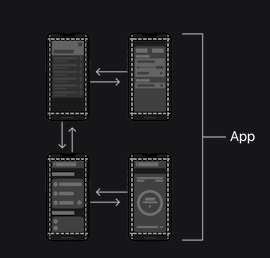
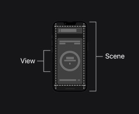
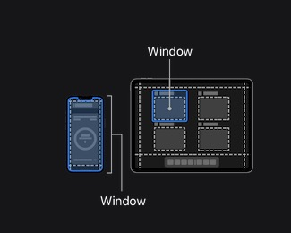
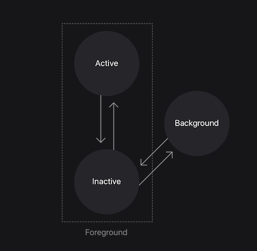
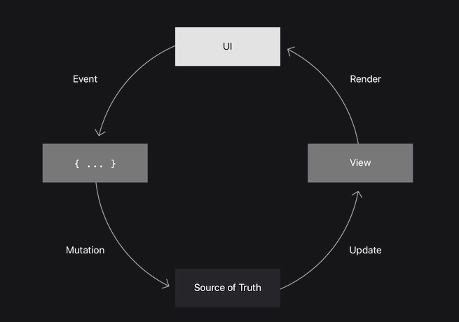

[toc]

# [事件响应](https://developer.apple.com/tutorials/app-dev-training/responding-to-events)（Responding to Events）

正如您在本模块中所了解到的，您可以使用 SwiftUI 属性包装器来管理应用程序 UI 中的状态并响应用户交互。 但是，您如何执行操作以响应应用程序状态的变化？

本文介绍了 SwiftUI 场景架构、应用程序状态和响应事件的视图，包括屏幕上出现和消失的视图。

## 场景架构（Scene Architecture）

在探索应用状态之前，先回顾一下 SwiftUI 如何组织场景。 场景是应用程序 UI 的一部分，具有系统管理的生命周期。

要创建应用程序，您需要定义一个符合 App 协议的结构。 通过在定义前面加上 @main 属性，您可以通知系统这是您的应用程序的唯一入口点。

在“在列表中显示数据”中，当您将 Scrumdinger 的根视图设置为 ScrumsView 时，您使用了应用程序的结构。

在 ScrumdingerApp 中，在结构体中，您可以添加一个或多个符合 Scene 协议的场景。 场景是您的应用呈现的视图层次结构的容器。 例如，您可能会将您的应用程序设计为在 iOS 和 watchOS 中显示一个场景，但在 macOS 和 iPadOS 中显示多个场景。

SwiftUI 提供了 Scrumdinger 使用的 WindowGroup 等原始场景。 系统管理场景的生命周期并显示适合平台和上下文的视图层次结构。 例如，iPadOS 上的多任务处理可以同时显示同一应用程序的多个较小实例。

## 场景阶段和过渡（Scene Phases and Transitions）

在应用程序执行期间，场景可以在三个阶段之间转换：

* active —— 一个场景在前景中，用户可以与之交互
* inactive ——场景可见，但系统禁用了与场景的交互。 例如，在多任务模式下，您可以在其他面板旁边看到您的应用程序面板，但它不是活动面板。
* background —— 应用程序正在运行，但场景在 UI 中不可见。 场景在应用程序终止之前进入此阶段。

您可以使用 scenePhase 环境值读取场景的当前状态。 有时，您会希望您的应用程序在场景转换到另一个阶段时执行一组操作。

在持久性和并发一章中，您将使用 Scrumdinger 中的 onChange(of:perform:) 修饰符来保存应用程序在多次启动时的状态。 当场景阶段变为非活动状态时，您将使用此修饰符触发保存应用程序数据的操作。

要了解有关场景和场景阶段的更多信息，请观看 [SwiftUI 中的应用要点](https://developer.apple.com/videos/play/wwdc2020/10037/)。

## 事件和状态（Events and State）

您可能熟悉命令式模式，它要求您改变视图以响应程序状态的变化。 SwiftUI 遵循声明性语言模式。 在 SwiftUI 视图主体中，您描述了 UI 在每个状态下的显示方式。 在执行期间，系统通过在状态更改时更新 UI 的相关部分来保持状态和 UI 同步。

下图表示 SwiftUI 如何响应用户发起的事件或应用程序状态的更改。

* 用户交互或通知之类的事件（Event）会导致应用做出响应。
* 闭包（{ ... }）响应事件运行，这可能导致事实来源（Source of Truth）发生突变（Mutation）。
* 在观察到一个突变后，SwiftUI 会更新视（update）图并渲染（Render） UI。

## 视图生命周期事件（View Life Cycle Events）

除了用户交互之外，您可能还想在视图打开或关闭屏幕时更改应用的状态。例如，您可能希望在每次视图出现时重置视图的控件或从网络服务器获取更新的信息。

SwiftUI 包含三个响应视图生命周期事件的修饰符：

* onAppear(perform:)

  会在视图出现在屏幕上的任何时候触发动作，即使这不是第一次。

* onDisappear(perform:)

  当视图从屏幕上消失时触发动作

* task(priority:_:)

  当视图出现在屏幕上时触发异步执行的动作

使用这些修饰符，您可以在视图出现或消失时执行更改应用程序状态的操作。就像在用户发起的事件中一样，SwiftUI 为您管理视图层次结构，并通过更新 UI 以反映更新后的状态来响应状态更改。

要了解有关 SwiftUI 视图生命周期的更多信息，请观看 [Demystify SwiftUI](https://developer.apple.com/videos/play/wwdc2021/10022/)。

在以下教程中，您将实现这些方法来启动和停止 scrum 计时器、管理宣布演讲者时间结束的视听播放器、控制语音识别器以及添加 scrum 的历史记录。