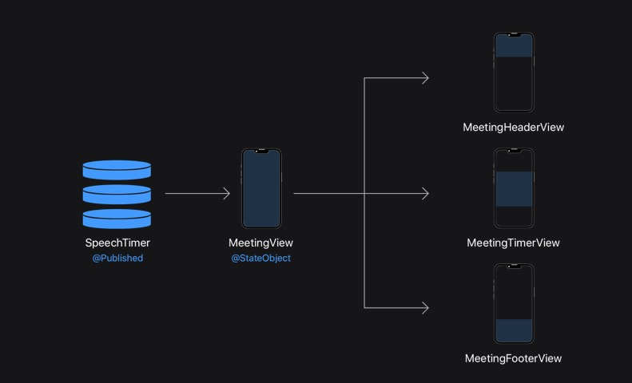
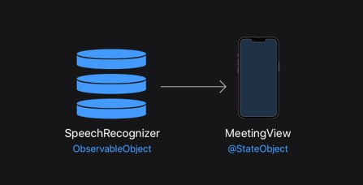
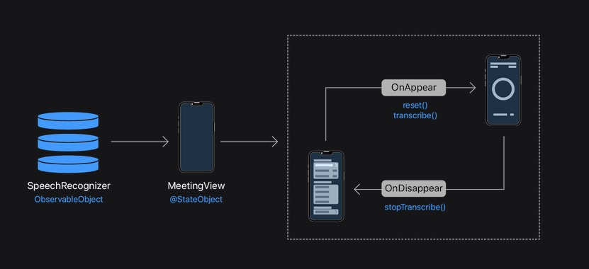

[toc]

# [在 Scrumdinger 中检查数据流](https://developer.apple.com/tutorials/app-dev-training/examining-data-flow-in-scrumdinger)

Scrumdinger 在启动项目中包含两个模型对象：ScrumTimer 和 SpeechRecognizer。 这些对象管理显示在 Scrumdinger 界面中的动态数据。

您已经在之前的教程中使用过 ScrumTimer。 在下一个教程中，您将创建 SpeechRecognizer 的一个实例。 在本文中，您将探索这些模型对象以及它们如何使用熟悉的 SwiftUI 状态管理和生命周期功能实现数据流。

## Scrum Timer Meeting Properties

首先重新检查 ScrumTimer 数据模型。在管理状态和生命周期中，您在会议视图中实例化了 scrum 计时器并创建了会议页眉和页脚子视图。这些视图显示几个会议属性：当前发言人、已用时间和剩余时间。

在查看实施之前，请考虑一下您已经知道的 SwiftUI 工具，并考虑您如何使用这些工具来构建会议视图。因为这些会议属性经常更新，所以您希望创建一个动态视图，当这些值更改时会更新。

## Scrum Timer Data Flow

ScrumTimer 使用@Published 属性存储会议属性，并使用计时器来频繁更新这些属性的值。

会议视图声明了一个名为 scrumTimer 的 @StateObject 属性作为其视图层次结构的真实来源。三个子视图依赖于 scrumTimer 的属性。当 scrumTimer 中的数据发生变化时，SwiftUI 会使用最新数据重绘会议视图及其子视图。

因为子视图只读取数据而不写入数据，所以不需要添加绑定。 数据源自 ScrumTimer 对象并沿视图层次结构向下流动。

## 语音识别器架构

下一教程中的入门项目提供 SpeechRecognizer 类。 语音识别器访问麦克风以捕获音频，然后将可听语音转录为文本。

与 scrum 计时器一样，语音识别器也符合 ObservableObject 协议。 语音识别器比 Scrumdinger 中的其他类型占用更大的内存，因此您要避免创建不必要的实例。 您将使用 @StateObject 创建应用程序在其整个生命周期中使用的语音识别器的单个实例。

尽管 ScrumTimer 和 SpeechRecognizer 模型都是可观察的对象，但关键区别在于它们如何将数据输入视图。 scrum timer 的会议属性需要经常更新，但更新不依赖于会议视图的生命周期。语音识别器创建一个文字记录对象，但文字记录不需要@Published 属性，因为 MeetingView 只需要知道文字记录属性的结束值。那么 MeetingView 是如何知道何时从语音识别器中读取信息的呢？

## 语音识别动作的时机

语音识别器处理音频和转录任务的细节，例如验证设备访问、启动和管理音频引擎，以及从 SFSpeechRecognizer 和 AVAudioSession 类创建必要的对象。数据模型公开了您的视图可以用来影响语音识别过程的几种方法。在下一个教程中，您将使用这些方法在 MeetingView 生命周期的关键时刻控制语音识别。

当 MeetingView 出现时，您将调用以下方法：

* reset() 方法通过停止任何正在运行的任务并将值重置为其默认值来准备语音识别器以进行转录。
* transcribe() 方法开始语音转录

当视图消失时，以下操作会影响转录：

* topTranscribing() 方法结束转录并停止将更改写入转录属性
* 该视图使用转录文本创建新的会议历史记录

通过读取生命周期方法中的 transcript 属性等数据，您可以管理只需要发生一次的任务，例如当视图消失时。

SwiftUI 提供了管理动态数据和保持视图同步所需的所有工具。 决定使用哪种工具来满足您的需求是构建有效的 SwiftUI 应用程序所面临的挑战的一部分。 此处的模式只是您继续构建自己的应用程序时要考虑的一种选择。